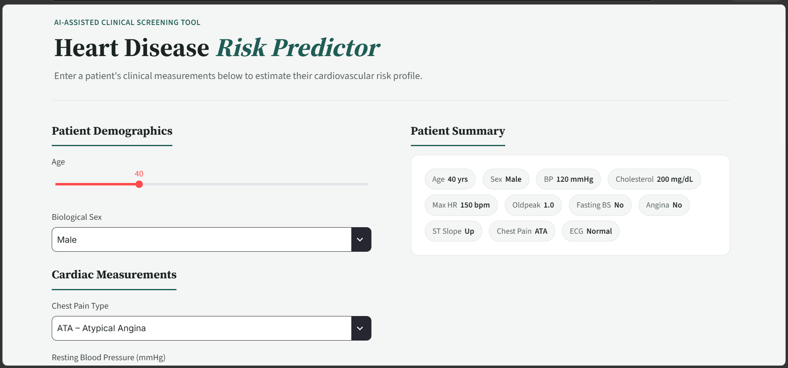
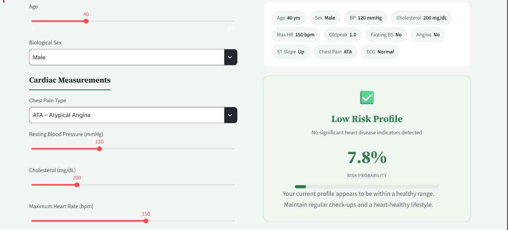
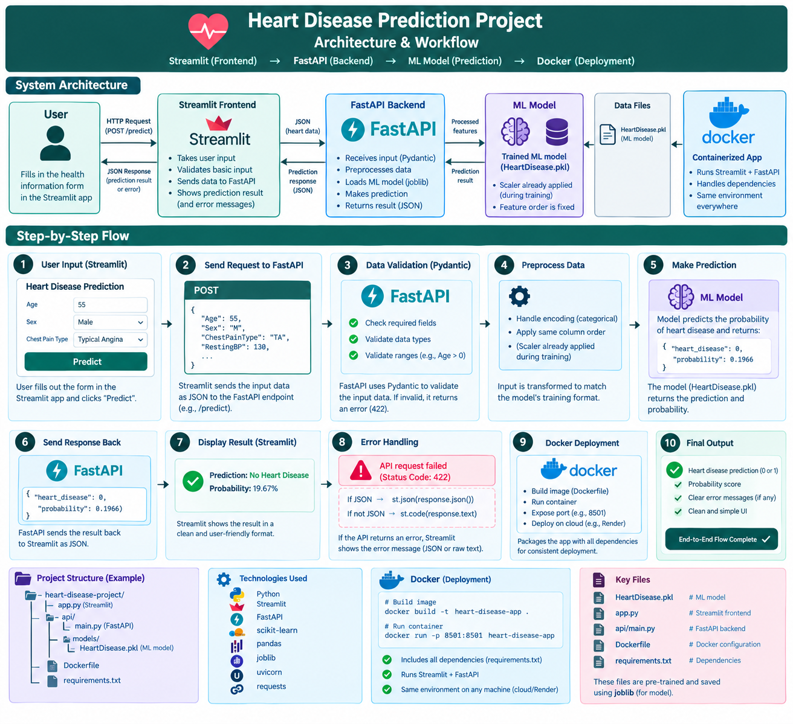

# 🫀 Heart Disease Predictor


An updated version of my previous Heart Disease Predictor, built with **Machine Learning, FastAPI, and Docker**. It uses a trained **Logistic Regression** model to predict heart disease risk and provide probability scores.

The new version adds **FastAPI for the prediction API** and **Docker for containerization and deployment**, making the application more structured and production-ready.


---
## 🔗 Live Demo

Try the deployed Streamlit frontend:

- Website: https://heart-disease-predictor-mat.streamlit.app/

---
## 📋 Table of Contents

- [Overview](#overview)
- [Key Features](#key-features)
- [Architecture](#architecture)
- [Technology Stack](#technology-stack)
- [Installation](#installation)
- [Docker Deployment](#docker-deployment)
- [Live Demo](#live-demo)
- [Usage](#usage)
- [API Documentation](#api-documentation)
- [Screenshots](#screenshots)
- [Project Structure](#project-structure)
- [Future Enhancements](#future-enhancements)
- [License](#license)

---

## 🎯 Overview

Heart Disease Predictor is a clinical-grade web application designed to estimate cardiovascular risk using machine learning. The application processes patient medical data through a trained Logistic Regression model and provides risk probability scores with professional clinical insights.

**Use Case:** This tool assists healthcare professionals and patients in understanding heart disease risk factors and facilitating informed clinical discussions.

⚠️ **Disclaimer:** This application is for educational and research purposes only and does not replace professional medical diagnosis.

---

## ✨ Key Features

- 🤖 Advanced ML Model — Trained Logistic Regression Classifier
- ⚡ FastAPI Backend — High-performance REST API with automatic validation
- 🎨 Professional UI — Streamlit frontend with clinical-grade design language
- 🐳 Docker Support — Containerized deployment for easy scaling
- 📊 Real-time Predictions — Instant risk assessment with probability scores
- 🔒 Data Validation — Pydantic-based input validation for data integrity
- 📈 Feature Importance — Clear visualization of contributing risk factors
- 🚀 Production Ready — Error handling, logging, and graceful degradation

---

## 🏗️ Architecture

```
┌─────────────────────────────────────────────────────────┐
│                                                         │
│            🖥️ STREAMLIT FRONTEND (Port 8501)            │
│                                                         │
│  Patient Input Interface → Risk Visualization           │
│                                                         │
└────────────────────┬────────────────────────────────────┘
                     │ HTTP Request
                     ↓
┌─────────────────────────────────────────────────────────┐
│                                                         │
│         ⚡ FASTAPI BACKEND (Port 8000)                   │
│                                                         │
│  /predict endpoint → Model Inference → Probability      │
│                                                         │
└────────────────────┬────────────────────────────────────┘
                     │
                     ↓
         ┌───────────────────────┐
         │                       │
         │   🤖 ML MODEL         │
         │   Random Forest       │
         │   (Heart_Disease.pkl) │
         │                       │
         └───────────────────────┘
```

### Data Flow

The diagram below (`photos/Architecture_of_heart_disease.png`) walks through the full end-to-end request lifecycle, from the moment a user fills in the form to the moment a risk score is rendered back on screen:

1. **User Input (Streamlit)** — The user fills out the clinical form (Age, Sex, Chest Pain Type, Resting BP, etc.) and clicks **"Predict."**
2. **Send Request to FastAPI** — Streamlit packages the form values into a JSON payload and sends a `POST` request to the `/predict` endpoint.
3. **Data Validation (Pydantic)** — FastAPI validates the incoming payload: required fields are present, data types are correct, and value ranges make sense (e.g. `Age > 0`). Invalid input returns an HTTP `422` error.
4. **Preprocess Data** — Categorical fields are encoded and columns are reordered to exactly match the format the model was trained on. Note that scaling was already applied during training, so this step focuses on encoding and column alignment.
5. **Make Prediction** — The trained Random Forest model (`Heart_Disease.pkl`) runs inference and returns both a binary classification and a probability score, e.g. `{"heart_disease": 0, "probability": 0.1966}`.
6. **Send Response Back** — FastAPI serializes the result as JSON and sends it back to the Streamlit frontend.
7. **Display Result (Streamlit)** — The frontend renders the outcome in a clean, human-readable card (e.g. *"Prediction: No Heart Disease — Probability: 19.67%"*).
8. **Error Handling** — If the API call fails (e.g. a `422` validation error), Streamlit gracefully displays either the parsed JSON error or the raw response text instead of crashing.
9. **Docker Deployment** — The whole stack (Streamlit + FastAPI + model + dependencies) is packaged into a Docker image, so it behaves identically whether run locally or deployed to the cloud (e.g. Render).
10. **Final Output** — The end user sees a clear verdict (0/1), a probability score, any relevant error messages, and a simple, uncluttered UI — completing the flow.

---

## 📦 Technology Stack

| Component         | Technology            | Version |
|------------------:|:---------------------:|:-------:|
| Language          | Python                | 3.11+   |
| Web Framework     | FastAPI               | 0.100+  |
| ASGI Server       | Uvicorn               | 0.20+   |
| Frontend          | Streamlit             | 1.30+   |
| ML Framework      | Scikit-learn          | 1.8.0+  |
| Data Processing   | Pandas                | 2.0+    |
| Validation        | Pydantic              | 2.0+    |
| Serialization     | Joblib                | 1.3+    |
| Containerization  | Docker                | Latest  |
| Visualization     | Matplotlib, Seaborn   | Latest  |

---

## 💻 Installation

### Prerequisites
- Python 3.11+
- pip
- Git

### Local Setup (Without Docker)

1. Clone the repository:

```bash
git clone https://github.com/tyhan-data/heart-disease-predictor.git
cd heart-disease-predictor
```

2. Create and activate a virtual environment:

```bash
python -m venv venv
# Windows
venv\Scripts\activate
# macOS/Linux
source venv/bin/activate
```

3. Install dependencies:

```bash
pip install --upgrade pip
pip install -r requirements.txt
```

4. Run the application in two terminals:

Terminal 1 — FastAPI backend:

```bash
python -m uvicorn app.main:app --host 0.0.0.0 --port 8000 --reload
```

Terminal 2 — Streamlit frontend:

```bash
streamlit run streamlit_app.py
```

Open:
- Frontend: http://localhost:8501
- API docs: http://localhost:8000/docs

---

## 🐳 Docker Deployment

Prerequisites:
- Docker ([Get Docker](https://docs.docker.com/get-docker/))
- Docker Compose (optional)

### Use the published Docker image
An official image is available on Docker Hub:

- Docker Hub: https://hub.docker.com/r/tyhan55/heart-api

Pull and run the published image:

```bash
docker pull tyhan55/heart-api:latest
docker run -d --name heart-disease-api -p 8000:8000 tyhan55/heart-api:latest
```

### Build from source

```bash
docker build -t heart-disease-predictor:latest .

docker run -d --name heart-disease-api -p 8000:8000 heart-disease-predictor:latest
```

Docker Compose (optional): create `docker-compose.yml` and run `docker-compose up -d`.

---


## 🚀 Usage

### Streamlit UI
Fill the patient form and click "Analyse Heart Disease Risk" to get:
- Risk classification (Low/High)
- Probability score
- Clinical recommendations

### API (cURL)

```bash
curl -X POST http://localhost:8000/predict \
  -H "Content-Type: application/json" \
  -d '{
    "Age": 45,
    "Sex": "M",
    "ChestPainType": "ATA",
    "RestingBP": 130,
    "Cholesterol": 250,
    "FastingBS": "0",
    "RestingECG": "Normal",
    "MaxHR": 130,
    "ExerciseAngina": "N",
    "Oldpeak": 1.5,
    "ST_Slope": "Down"
  }'
```

Response:

```json
{
  "HeartDisease": 1,
  "probability": 0.87
}
```

---

## 📡 API Documentation

Base URL: `http://localhost:8000`

Endpoints:
- GET `/` — health check
- POST `/predict` — prediction endpoint
- GET `/docs` — Swagger UI
- GET `/redoc` — ReDoc

---

## 🖼️ Screenshots

Included screenshots (see `/photos` directory):

- `photos/dashboard.png` — Main Streamlit dashboard
- `photos/prediction_result.png` — Prediction result view
- `photos/api_docs.png` — API documentation (Swagger UI)

### Home Page — Patient Input Form



The landing screen is labeled **"AI-Assisted Clinical Screening Tool"** and presents a clean, two-column clinical layout:

- **Left column — Patient Demographics & Cardiac Measurements:** interactive sliders and dropdowns for Age, Biological Sex, Chest Pain Type, Resting Blood Pressure, and other clinical inputs. Sliders show the live selected value (e.g. Age = 40) directly above the track for quick visual feedback.
- **Right column — Patient Summary:** a live-updating summary panel made of compact "pill" badges (Age, Sex, BP, Cholesterol, Max HR, Oldpeak, Fasting BS, Angina, ST Slope, Chest Pain, ECG) that mirror the form inputs in real time, so the user can double-check their entries at a glance before submitting.

This design keeps the data-entry experience simple for non-technical users while still surfacing every clinical parameter the model needs.

### Prediction Result View



After clicking **Predict**, the same Patient Summary panel remains visible at the top for context, and a result card appears below it:

- A green checkmark icon and **"Low Risk Profile"** heading indicate a favorable outcome, with the subtext **"No significant heart disease indicators detected."**
- A large, prominent **risk probability percentage** (e.g. `7.8%`) is displayed along with a horizontal progress bar that visually represents how far along the risk scale the patient falls.
- A short, plain-language recommendation follows (e.g. *"Your current profile appears to be within a healthy range. Maintain regular check-ups and a heart-healthy lifestyle."*), translating the raw probability into an actionable clinical takeaway.

This result view is designed so a patient or clinician can interpret the outcome in seconds — color coding (green for low risk) and simple language do the heavy lifting instead of raw model output.

### System Architecture & Workflow Diagram



This infographic-style diagram documents the entire system end-to-end: the high-level component map (Streamlit → FastAPI → ML Model → Docker) at the top, followed by a numbered 10-step breakdown of the request lifecycle (see the [Data Flow](#data-flow) section above for the full walkthrough), plus reference panels for the project's file structure, technology stack, Docker build/run commands, and key files. It's a useful one-page reference for onboarding new contributors.

---

## 📁 Project Structure

```
heart-disease-predictor/
├── README.md
├── LICENSE
├── requirements.txt
├── Dockerfile
├── streamlit_app.py
├── app/
│   ├── main.py
│   ├── schemas.py
│   └── model_service.py
├── dataset/
│   └── heart_disease_data.csv
├── photos/
│   ├── dashboard.png
│   ├── prediction_result.png
│   └── api_docs.png
└── Heart_Disease.pkl
```

Notes:
- Confirm that `Heart_Disease.pkl` exists (model file). If not present, update `app/model_service.py` to point to your model artifact.
- Ensure `requirements.txt` lists exact package versions for reproducible builds.

---

## 🔧 Configuration

Environment variables (optional):

```bash
API_HOST=0.0.0.0
API_PORT=8000
API_RELOAD=true
STREAMLIT_LOGGER_LEVEL=info
STREAMLIT_CLIENT_THEME=light
```

Change API endpoint in `streamlit_app.py`:

```python
API_URL = "http://127.0.0.1:8000/predict"
```

Model path in `app/model_service.py`:

```python
MODEL_PATH = BASE_DIR / "Heart_Disease.pkl"
```

---

## 📊 Model Information

Algorithm: Random Forest Classifier
- Training data: UCI Heart Disease Dataset (303 samples)
- Features: 11 clinical parameters
- Output: Binary classification (0 = No Disease, 1 = Disease)
- Probability: Model confidence score (0–1)

Input features: Age, Sex, ChestPainType, RestingBP, Cholesterol, FastingBS, RestingECG, MaxHR, ExerciseAngina, Oldpeak, ST_Slope

---

## 🚀 Future Enhancements

- Model explainability (SHAP/LIME)
- Multi-model ensemble
- User authentication & history
- Database integration (PostgreSQL)
- Monitoring dashboard
- Mobile app
- CI/CD (GitHub Actions)
- Kubernetes manifests
- Advanced visualizations
- Model versioning & A/B testing

---

## 🐛 Troubleshooting

- FastAPI not connecting — check port usage and run on different port
- Model file not found — ensure `Heart_Disease.pkl` exists in repo root
- Streamlit can't reach API — verify API is running and update `API_URL`
- Docker container exits — check `docker logs` and run container interactively

---

## 📝 License

This project is licensed under the MIT License — see `LICENSE`.

---

## 👨‍💻 Author

M.A.T — Healthcare AI Developer

---

## 🙏 Acknowledgments

- UCI Machine Learning Repository
- FastAPI & Streamlit communities
- Open-source ML ecosystem

---

## 📧 Support

Open an issue or submit a pull request on GitHub.

---

**Last Updated:** September 2026
**Version:** 2.3
